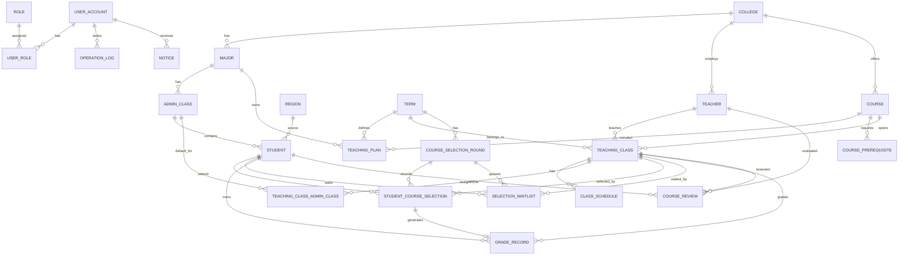

# 高校智慧教务与校园管理系统产品稿

## 0. 文档说明

本文档用于指导“高校智慧教务与校园管理系统”的产品设计、数据库设计、前后端页面开发和课程设计报告撰写。

本文档采用逐模块迭代方式编写。当前版本先完成：

- 产品定位与角色边界。
- 总体技术选型。
- 核心业务闭环。
- 核心 E-R 图。
- 全局界面布局规范。
- 管理员端第一批页面设计。

后续确认后继续补充：

- 学生端抢课与课表页面。
- 教师端教学班、成绩和评教页面。
- 统计分析端页面。
- AI 选课助手页面。
- 关键交互流程与接口字段。
- 数据库表级产品说明。

## 1. 产品定位

### 1.1 产品名称

建议系统名称：

```text
高校智慧教务与校园管理系统
```

课程设计报告中可以使用完整名称：

```text
面向高并发选课场景的高校智慧教务与校园管理系统
```

### 1.2 产品目标

本系统面向高校教务管理场景，围绕学生、教师和教务管理员三类核心角色，提供基础数据维护、课程目录管理、教学班管理、培养计划管理、抢课选课、候补队列、成绩录入、课表生成、统计分析和 AI 选课辅助等功能。

产品目标不是做一个简单的 CRUD 管理后台，而是构建一个能够体现数据库系统课程设计要求的完整 Demo：

- 业务上贴近真实高校教务系统。
- 数据库上体现 E-R 建模、关系模式、主外键、约束、视图、索引、触发器、存储过程。
- 架构上体现 Redis、RabbitMQ、openGauss 在高并发选课中的分工。
- 产品上体现需求调研对最终功能设计的影响。
- 工程上体现 Spring Boot + Vue 前后端分离开发规范。

### 1.3 用户角色

| 角色       | 核心目标               | 典型操作                                           |
| ---------- | ---------------------- | -------------------------------------------------- |
| 系统管理员 | 维护系统基础数据与权限 | 用户管理、角色权限、公告、日志                     |
| 教务管理员 | 维护教学运行数据       | 学院、专业、班级、培养计划、课程、教学班、选课轮次 |
| 教师       | 管理本人教学班         | 查看教学班、学生名单、录入成绩、查看评教           |
| 学生       | 完成选课与学习信息查询 | 抢课、退课、候补、查看课表、查看成绩、评教         |

课程设计中可以将“系统管理员”和“教务管理员”合并为管理员端，以降低实现复杂度；报告中仍可说明权限可扩展。

## 2. 总体技术选型

### 2.1 前端技术栈

| 技术         | 作用         | 选择理由                             |
| ------------ | ------------ | ------------------------------------ |
| Vue 3        | 前端页面框架 | 适合快速构建 SPA 管理系统            |
| TypeScript   | 类型约束     | 提升大型表单和接口字段维护性         |
| Vite         | 构建工具     | 启动快，配置简单                     |
| Vue Router   | 路由管理     | 支持管理员、教师、学生多端页面       |
| Pinia        | 状态管理     | 保存用户信息、Token、菜单权限        |
| Element Plus | UI 组件库    | 表格、表单、弹窗、分页、布局组件成熟 |
| Axios        | HTTP 请求    | 与 Spring Boot REST API 对接         |
| ECharts      | 数据可视化   | 用于成绩统计、选课统计、生源统计     |

### 2.2 后端技术栈

| 技术              | 作用         | 选择理由                               |
| ----------------- | ------------ | -------------------------------------- |
| Java 17           | 后端语言     | Spring Boot 3 推荐版本，稳定成熟       |
| Spring Boot 3     | 后端主框架   | 快速开发 REST API                      |
| Spring Web        | Web 接口     | 提供 HTTP API                          |
| Spring Security   | 认证授权     | 支持登录、角色权限、接口权限           |
| JWT               | 登录令牌     | 适合前后端分离                         |
| MyBatis-Plus      | ORM 和 CRUD  | 快速完成基础管理模块                   |
| MyBatis XML       | 复杂 SQL     | 用于统计、课表冲突、选课事务等复杂查询 |
| Bean Validation   | 参数校验     | 统一校验请求字段                       |
| Knife4j / Swagger | 接口文档     | 便于调试，也可作为报告截图             |
| Lombok            | 简化实体代码 | 减少样板代码                           |

### 2.3 数据库与中间件

| 技术           | 作用                     | 选择理由                                  |
| -------------- | ------------------------ | ----------------------------------------- |
| openGauss      | 核心关系数据库           | 满足课程要求，承载最终业务数据            |
| Redis          | 选课容量缓存、原子预扣减 | 支撑高并发抢课中的热点容量控制            |
| RabbitMQ       | 选课请求队列             | 削峰填谷，异步处理抢课请求                |
| Nginx          | 前端部署和反向代理       | 适合云上部署演示                          |
| Docker Compose | 本地/云上编排            | 统一部署 openGauss、Redis、RabbitMQ、后端 |

### 2.4 可选 AI 技术栈

| 技术               | 作用             | 备注                                     |
| ------------------ | ---------------- | ---------------------------------------- |
| openGauss DataVec  | 向量存储与检索   | 用于课程简介、教师评价、课程反馈语义检索 |
| Embedding 模型     | 文本转向量       | 可使用本地模型或云端 API                 |
| LLM API / 本地模型 | 生成自然语言回答 | 时间不足时可用模板化回答替代             |

AI 模块不是主线验收功能，建议作为创新扩展。主线必须优先保证数据库设计、抢课、成绩和统计模块完整。

## 3. 总体业务闭环

系统的核心业务闭环如下：

1. 管理员维护学院、专业、行政班、学生、教师等基础数据。
2. 管理员维护某专业某年级某学期的培养计划。
3. 管理员维护课程目录。
4. 管理员在某学期为课程创建多个教学班。
5. 管理员给教学班设置教师、时间、地点、容量和默认行政班。
6. 管理员发布选课轮次，设置抢课开始和结束时间。
7. 学生进入抢课页面，查看本学期培养计划内可选课程和各教学班。
8. 默认教学班显示为已选，按钮显示“退选”。
9. 学生可退课、重新选择其他教学班或进入候补队列。
10. 高并发选课请求通过 Redis 预扣减、RabbitMQ 排队、openGauss 事务落库完成。
11. 教师查看本人教学班和学生名单。
12. 教师按教学班录入成绩。
13. 学生查看课表、成绩、学分和通知。
14. 管理员查看选课、成绩、课程、生源等统计分析。

## 4. 核心 E-R 图

### 4.1 概念说明

本系统的核心设计是将“课程”拆分为“课程目录”和“教学班”：

- 课程目录表示一门长期存在的课程，例如数据库系统。
- 教学班表示某课程在某学期的一次具体开课，例如数据库系统 001 班。
- 学生实际选择的是教学班，不是课程目录。
- 培养计划决定学生本学期有哪些课程可选。
- 默认行政班分配决定学生默认进入哪个教学班。
- 候补队列用于教学班满员后的排队转正。

### 4.2 核心 E-R 图



### 4.3 核心实体清单

| 实体                       | 说明           | 关键字段                                   |
| -------------------------- | -------------- | ------------------------------------------ |
| college                    | 学院           | 学院编号、学院名称                         |
| major                      | 专业           | 专业编号、所属学院、专业名称               |
| admin_class                | 行政班         | 班级编号、所属专业、年级、班级名称         |
| student                    | 学生           | 学号、姓名、行政班、生源地、已修学分       |
| teacher                    | 教师           | 工号、姓名、学院、职称                     |
| term                       | 学期           | 学年、学期、开始日期、结束日期             |
| course                     | 课程目录       | 课程代码、课程名称、学分、学时、课程类型   |
| teaching_plan              | 培养计划       | 专业、年级、学期、课程、课程性质           |
| teaching_class             | 教学班         | 课程、教师、学期、容量、已选人数、候补人数 |
| class_schedule             | 上课安排       | 教学班、星期、节次、周次、教室             |
| teaching_class_admin_class | 默认行政班分配 | 教学班、行政班                             |
| course_selection_round     | 选课轮次       | 学期、开始时间、结束时间、状态             |
| student_course_selection   | 选课记录       | 学生、教学班、轮次、状态、选课时间         |
| selection_waitlist         | 候补队列       | 学生、教学班、轮次、排队序号、候补状态     |
| grade_record               | 成绩记录       | 选课记录、平时分、考试分、总评、绩点       |
| course_review              | 课程评教       | 学生、教学班、教师、评分、评价内容         |
| notice                     | 通知           | 用户、标题、内容、已读状态                 |
| operation_log              | 操作日志       | 操作人、操作类型、目标表、操作前后值       |

## 5. 全局产品结构

### 5.1 端划分

系统分为三端：

```text
管理员端
教师端
学生端
```

三端共用同一套登录页和基础布局，通过登录用户角色加载不同菜单。

### 5.2 全局布局

系统采用类似学校官方教务系统的顶部导航栏布局，而不是左侧菜单布局。

全局导航栏始终保持不变。用户点击顶部一级功能区时，通过下拉菜单选择该功能区下的详细功能；选择后，下方主内容区域切换到对应功能页面。

布局结构：

```text
┌──────────────────────────────────────────────────────────────┐
│ 蓝色系统头部：系统 Logo / 系统名称 / 当前用户 / 退出登录       │
├──────────────────────────────────────────────────────────────┤
│ 顶部导航栏：报名申请 ▾  信息维护 ▾  选课 ▾  信息查询 ▾       │
│           教学评价 ▾  毕业设计(论文) ▾  公共查询 ▾  课表查询 ▾ │
├──────────────────────────────────────────────────────────────┤
│ 主内容区域：根据下拉菜单选择的功能页面进行切换                │
└──────────────────────────────────────────────────────────────┘
```

参考视觉：

- 顶部系统头部使用蓝色背景，突出系统名称。
- 导航栏使用白色背景，一级菜单横向排列。
- 一级菜单右侧带下拉箭头。
- 下拉菜单悬浮显示具体功能项。
- 页面切换只改变主内容区域，不改变全局顶部导航。

本项目建议将一级导航设计为：

```text
首页
信息维护
教学资源
选课
成绩管理
信息查询
教学评价
公共查询
系统管理
```

### 5.3 页面通用规范

列表页统一结构：

```text
页面标题
筛选表单
操作按钮
数据表格
分页器
新增/编辑弹窗
删除确认弹窗
```

详情页统一结构：

```text
基础信息区
关联数据区
操作记录区
返回按钮
```

状态颜色建议：

| 状态             | 颜色 | 用途                     |
| ---------------- | ---- | ------------------------ |
| 正常/已开放/成功 | 绿色 | 可选、已选、已发布       |
| 处理中           | 蓝色 | 选课处理中、候补转正中   |
| 警告/候补        | 橙色 | 候补中、容量紧张         |
| 禁用/结束        | 灰色 | 选课结束、不可选         |
| 失败/冲突        | 红色 | 时间冲突、容量不足、失败 |

### 5.4 菜单结构总览

管理员端：

```text
首页
信息维护
  学院管理
  专业管理
  行政班管理
  学生管理
  教师管理
教学资源
  学期管理
  课程目录
  培养计划
  教学班管理
  教室安排
选课
  选课轮次
  抢课监控
  选课记录
  候补队列
成绩管理
  成绩审核
  成绩统计
通知公告
统计分析
系统管理
  用户管理
  角色权限
  操作日志
```

教师端：

```text
首页
我的教学班
学生名单
成绩录入
成绩统计
课程评教
通知公告
个人中心
```

学生端：

```text
首页
抢课选课
我的课表
我的选课
我的候补
我的成绩
网上评教
AI 选课助手
通知公告
个人中心
```

## 6. 管理员端页面设计

本节先设计管理员端第一批核心页面，主要服务数据库设计和系统验收展示。

### 6.1 管理员首页

#### 页面目标

管理员首页保持简洁，不堆砌过多统计信息。首页主要展示当前管理员账号的基本信息、近期教务公告和系统通知，作为登录后的个人工作台。

#### 页面布局

`	ext
页面标题：首页

第一块：个人信息卡片
  左侧：头像
  右侧：
    姓名
    登录账号
    角色
    所属部门
    最近登录时间

第二块：当前学期信息
  当前学年学期
  当前选课轮次状态
  系统日期

第三块：公告通知
  教务公告列表
  系统通知列表
  点击公告进入详情

第四块：快捷入口
  课程目录
  教学班管理
  选课轮次
  抢课监控
`

#### 功能点

- 查看管理员个人基本信息。
- 查看当前学期和当前选课轮次状态。
- 查看近期教务公告和系统通知。
- 通过快捷入口进入常用功能。

#### 技术实现

- 前端：Vue + Element Plus Card、Avatar、List。
- 后端：Spring Boot 提供当前用户信息、当前学期、公告列表接口。
- 数据库：user_account、
otice、	erm、course_selection_round。

### 6.2 学院管理页面

#### 页面目标

维护学校学院基础信息，是专业、教师和课程的上级组织。

#### 页面布局

```text
页面标题：学院管理

筛选区：
  学院名称输入框
  学院编码输入框
  查询按钮
  重置按钮

操作区：
  新增学院
  批量删除

表格列：
  学院编码
  学院名称
  联系电话
  创建时间
  状态
  操作：编辑 / 删除 / 查看专业

弹窗：
  新增/编辑学院表单
```

#### 字段设计

| 字段     | 输入控件 | 校验           |
| -------- | -------- | -------------- |
| 学院编码 | 输入框   | 必填，唯一     |
| 学院名称 | 输入框   | 必填           |
| 联系电话 | 输入框   | 可选，格式校验 |
| 状态     | 开关     | 启用/停用      |

#### 技术实现

- 前端：Element Plus Table、Dialog、Form。
- 后端：学院 CRUD 接口。
- 数据库：`college` 表，学院编码唯一索引。

### 6.3 专业管理页面

#### 页面目标

维护专业信息，专业归属于学院，培养计划以专业和年级为核心维度。

#### 页面布局

```text
页面标题：专业管理

筛选区：
  学院下拉框
  专业名称输入框
  年制下拉框

操作区：
  新增专业
  导入专业

表格列：
  专业编码
  专业名称
  所属学院
  学制
  学位类型
  最低毕业学分
  状态
  操作：编辑 / 删除 / 查看培养计划
```

#### 字段设计

| 字段         | 输入控件 | 校验           |
| ------------ | -------- | -------------- |
| 专业编码     | 输入框   | 必填，唯一     |
| 专业名称     | 输入框   | 必填           |
| 所属学院     | 下拉选择 | 必填           |
| 学制         | 数字输入 | 必填，大于 0   |
| 学位类型     | 下拉选择 | 本科/专科/硕士 |
| 最低毕业学分 | 数字输入 | 必填，大于 0   |

#### 技术实现

- 前端：学院下拉数据从学院接口加载。
- 后端：专业 CRUD，带学院关联查询。
- 数据库：`major` 表，`college_id` 外键。

### 6.4 行政班管理页面

#### 页面目标

维护行政班信息。行政班用于学生归属、默认教学班分配和统计分析，但不决定培养计划差异。同一专业同一年级的培养计划相同。

#### 页面布局

```text
页面标题：行政班管理

筛选区：
  学院下拉
  专业下拉
  年级下拉
  班级名称输入框

操作区：
  新增行政班

表格列：
  班级编码
  班级名称
  所属学院
  所属专业
  年级
  学生人数
  班主任
  操作：编辑 / 删除 / 查看学生
```

#### 字段设计

| 字段     | 输入控件 | 校验       |
| -------- | -------- | ---------- |
| 班级编码 | 输入框   | 必填，唯一 |
| 班级名称 | 输入框   | 必填       |
| 所属专业 | 级联选择 | 必填       |
| 年级     | 年份选择 | 必填       |
| 班主任   | 教师下拉 | 可选       |

#### 技术实现

- 前端：学院、专业级联选择。
- 后端：行政班 CRUD，统计学生人数。
- 数据库：`admin_class` 表，关联 `major`。

### 6.5 学生管理页面

#### 页面目标

维护学生基础信息，并支持生成学生账号。学生是选课、成绩、课表和评教的主体。

#### 页面布局

```text
页面标题：学生管理

筛选区：
  学号输入框
  姓名输入框
  学院下拉
  专业下拉
  行政班下拉
  学籍状态下拉

操作区：
  新增学生
  批量导入
  批量生成账号
  导出学生

表格列：
  学号
  姓名
  性别
  学院
  专业
  行政班
  生源地
  已修学分
  学籍状态
  操作：编辑 / 删除 / 重置密码 / 查看选课 / 查看成绩
```

#### 字段设计

| 字段     | 输入控件 | 校验           |
| -------- | -------- | -------------- |
| 学号     | 输入框   | 必填，唯一     |
| 姓名     | 输入框   | 必填           |
| 性别     | 单选     | 男/女          |
| 行政班   | 级联选择 | 必填           |
| 生源地   | 地区选择 | 可选           |
| 手机号   | 输入框   | 格式校验       |
| 学籍状态 | 下拉     | 在读/休学/毕业 |

#### 技术实现

- 前端：表格分页、导入按钮可作为扩展。
- 后端：学生 CRUD，账号生成接口。
- 数据库：`student` 表，学号唯一索引，行政班外键。

### 6.6 教师管理页面

#### 页面目标

维护教师基础信息，并支持后续分配教学班。

#### 页面布局

```text
页面标题：教师管理

筛选区：
  工号输入框
  姓名输入框
  学院下拉
  职称下拉

操作区：
  新增教师
  批量导入
  多选生成账号

表格列：
  工号
  姓名
  性别
  所属学院
  职称
  联系电话
  平均评分
  状态
  操作：编辑 / 删除 / 重置密码 / 查看教学班
```

#### 技术实现

- 前端：教师表格、教师详情抽屉。
- 后端：教师 CRUD。
- 数据库：`teacher` 表，工号唯一索引，学院外键。

### 6.7 学期管理页面

#### 页面目标

维护学期信息，所有培养计划、教学班、选课轮次和成绩都需要归属于具体学期。

#### 页面布局

```text
页面标题：学期管理

筛选区：
  学年输入
  学期下拉
  是否当前学期

操作区：
  新增学期
  设置当前学期

表格列：
  学年
  学期
  开始日期
  结束日期
  是否当前学期
  状态
  操作：编辑 / 删除 / 设置当前
```

#### 技术实现

- 数据库：`term` 表。
- 约束：同一时间只允许一个当前学期。
- 可通过业务逻辑或唯一约束辅助保证。

### 6.8 课程目录页面

#### 页面目标

维护学校长期存在的课程目录。课程目录不直接被学生抢课，学生实际选择的是课程下的教学班。

#### 页面布局

```text
页面标题：课程目录

筛选区：
  课程代码
  课程名称
  开课学院
  课程类型
  考核方式

操作区：
  新增课程
  导入课程

表格列：
  课程代码
  课程名称
  开课学院
  学分
  学时
  课程类型
  考核方式
  是否启用
  操作：编辑 / 删除 / 先修课 / 创建教学班
```

#### 字段设计

| 字段     | 输入控件 | 校验                        |
| -------- | -------- | --------------------------- |
| 课程代码 | 输入框   | 必填，唯一                  |
| 课程名称 | 输入框   | 必填                        |
| 开课学院 | 下拉     | 必填                        |
| 学分     | 数字输入 | 必填，大于 0                |
| 学时     | 数字输入 | 必填，大于 0                |
| 课程类型 | 下拉     | 必修/专业选修/公共选修/通识 |
| 考核方式 | 下拉     | 考试/考查                   |
| 课程简介 | 文本域   | 可选，用于 AI 检索          |

#### 技术实现

- 数据库：`course` 表。
- 课程代码唯一索引。
- 课程简介可进入 `course_knowledge` 表，用于 AI 选课助手扩展。

### 6.9 培养计划页面

#### 页面目标

配置某专业某年级某学期可以修读的课程。需要明确：同一专业同一年级培养计划相同，与行政班无关。

#### 页面布局

```text
页面标题：培养计划

筛选区：
  学院下拉
  专业下拉
  年级下拉
  学期下拉

操作区：
  新增计划课程
  批量删除课程

上方信息条：
  当前计划：计算机科学与技术 / 2024 级 / 2025-2026 第 1 学期

表格列：
  课程代码
  课程名称
  学分
  学时
  课程性质
  是否可选
  是否需要默认教学班
  操作：编辑 / 删除 / 查看教学班
```

#### 关键规则

- 培养计划维度是专业、年级、学期。
- 行政班不参与培养计划维度。
- 学生抢课页面只展示其培养计划内课程。
- 教学班默认行政班分配只影响默认已选教学班，不影响课程是否可选。

#### 技术实现

- 数据库：`teaching_plan` 表。
- 建议唯一约束：`major_id + grade_year + term_id + course_id`。
- 后端提供“根据学生查询本学期培养计划课程”的接口。

### 6.10 教学班管理页面

#### 页面目标

为某课程在某学期创建多个教学班，并配置教师、容量、时间、教室和默认行政班。

#### 页面布局

```text
页面标题：教学班管理

筛选区：
  学期下拉
  课程名称
  教师姓名
  教学班状态

操作区：
  新增教学班
  批量创建教学班
  导出教学班

表格列：
  教学班编号
  教学班名称
  课程名称
  任课教师
  学期
  容量
  已选人数
  候补人数
  上课时间
  默认行政班
  状态
  操作：编辑 / 时间地点 / 默认班级 / 学生名单 / 删除
```

#### 新增/编辑教学班弹窗

```text
基础信息：
  所属学期
  所属课程
  教学班名称
  任课教师
  最大容量
  状态

上课安排：
  星期
  开始节次
  结束节次
  周次
  教室

默认行政班：
  选择学院
  选择专业
  选择年级
  勾选行政班
```

#### 关键规则

- 一个课程在同一学期可以有多个教学班。
- 一个教学班只属于一个课程。
- 一个教学班可以默认分配给多个行政班。
- 教学班总容量原则上应大于或等于需要修读该课程的学生人数。
- 教学班已选人数由选课记录驱动，不建议人工随意修改。
- 候补人数由候补队列表统计。

#### 技术实现

- 数据库：`teaching_class`、`class_schedule`、`teaching_class_admin_class`。
- 后端保存教学班时需要校验课程、教师、学期是否存在。
- 后端可校验同一教师同一时间是否冲突。

### 6.11 选课轮次页面

#### 页面目标

发布选课轮次，控制学生抢课、退课和候补的开放时间。

#### 页面布局

```text
页面标题：选课轮次

筛选区：
  学期
  轮次名称
  轮次状态

操作区：
  新增轮次
  发布轮次
  结束轮次
  预热 Redis 容量

表格列：
  轮次名称
  学期
  开始时间
  结束时间
  状态
  候补队列
  涉及课程数
  参与学生数
  操作：编辑 / 发布 / 结束 / 监控 / 预热
```

#### 关键规则

- 未开始：学生只能查看，不能选课、退课、候补。
- 进行中：学生可以选课、退课、候补。
- 已结束：学生只能查看最终结果。
- 所有课程默认支持退课和候补。
- 系统不提供直接改选，学生必须先退选再重新选课或候补。

#### 技术实现

- 数据库：`course_selection_round`。
- Redis 预热：将教学班剩余容量写入 Redis。
- RabbitMQ：选课请求进入队列异步处理。

### 6.12 抢课监控页面

#### 所属导航

抢课监控属于顶部导航栏中的“选课”功能区。

```text
选课 ▾
  选课轮次
  抢课监控
  选课记录
  候补队列
```

其中，候补队列不单独作为优先开发页面，先放在抢课监控页面的右侧抽屉中展示。

#### 页面目标

抢课监控用于管理员查看当前选课轮次下的抢课信息和可视化数据，是高并发选课方案的主要验收展示页面。

#### 页面布局

```text
页面标题：抢课监控

顶部筛选：
  当前学期
  当前选课轮次
  课程名称
  教学班状态

第一块：抢课概览 KPI
  总请求数
  成功选课数
  候补人数
  失败请求数
  满员教学班数

第二块：抢课可视化
  左侧：选课请求状态分布饼图
  中间：热门教学班 Top10 柱状图
  右侧：候补人数 Top10 柱状图

第三块：教学班监控表格
  教学班编号
  课程名称
  任课教师
  容量
  已选人数
  剩余名额
  候补人数
  Redis 剩余容量
  状态
  操作：查看选课记录 / 查看候补队列 / 查看请求日志 / 同步容量

右侧抽屉：
  选课记录详情
  候补队列详情
  选课请求日志
```

#### 抢课信息展示

抢课监控页面需要展示以下信息：

- 当前选课轮次是否开放。
- 每个教学班容量、已选人数、剩余名额、候补人数。
- 教学班是否已满。
- Redis 中缓存的剩余容量。
- openGauss 中实际统计的剩余容量。
- 选课请求总数、成功数、失败数、候补数。
- 失败原因统计，例如容量已满、时间冲突、重复提交、不在培养计划内。

#### 展示状态

| 状态 | 含义 | 页面表现 |
|---|---|---|
| 可选 | 教学班未满且在选课时间内 | 绿色标签 |
| 已满 | 教学班容量已满 | 红色标签 |
| 候补中 | 有学生在候补队列 | 橙色标签 |
| 已结束 | 选课轮次结束 | 灰色标签 |
| 异常 | Redis 容量与数据库统计不一致 | 红色警告 |

#### 技术实现

- 前端：Vue + Element Plus Table、Drawer、Tag + ECharts。
- 后端：Spring Boot 聚合 openGauss 选课数据和 Redis 容量数据。
- 数据库：`student_course_selection`、`selection_waitlist`、`selection_request_log`、`teaching_class`。
- Redis：读取教学班剩余容量缓存。
- RabbitMQ：请求日志可以展示消息处理状态。

## 7. 当前规则确认

本轮确认结果：

1. 管理员端采用顶部导航栏 + 下拉功能菜单，不采用左侧菜单。
2. 管理员首页保持轻量，只展示管理员个人信息、当前学期、公告和快捷入口。
3. 培养计划只保留“专业 + 年级 + 学期 + 课程”维度，不加入行政班。
4. 教学班默认行政班分配只影响“默认已选”，不影响培养计划。
5. 学生换教学班必须先退选，再选择或候补，不提供直接改选。
6. 候补队列先放在抢课监控页面抽屉中，不作为优先独立页面。

后续继续按照该规则扩展学生端、教师端、统计分析和 AI 选课助手页面。

## 8. 学生端页面设计

学生端是系统验收中最能体现业务闭环的部分，重点展示“培养计划内课程 -> 教学班 -> 默认已选 -> 退选 -> 选课/候补 -> 课表生成 -> 成绩查询”的完整链路。

### 8.1 学生端导航结构

学生端同样使用顶部导航栏和下拉菜单。

```text
首页
选课
  抢课选课
  我的选课
  我的候补
课表查询
  我的课表
信息查询
  我的成绩
  我的学分
教学评价
  网上评教
公共查询
  教务公告
  考试安排
个人中心
  个人信息
  修改密码
AI 助手
  AI 选课助手
```

### 8.2 学生首页

#### 页面目标

学生首页保持轻量，主要展示学生个人信息、当前学期、近期公告、选课状态提醒。

#### 页面布局

```text
页面标题：首页

第一块：个人信息卡片
  头像
  姓名
  学号
  学院
  专业
  行政班
  年级

第二块：当前学期状态
  当前学年学期
  当前选课轮次
  选课轮次状态
  选课开始/结束时间

第三块：我的提醒
  已选课程数
  候补中课程数
  待评教课程数
  最新成绩发布提醒

第四块：公告通知
  教务公告
  考试安排
  系统通知
```

#### 功能点

- 查看学生个人基础信息。
- 查看当前选课轮次是否开放。
- 查看选课、候补、成绩、评教提醒。
- 点击快捷入口进入抢课选课、我的课表、我的成绩。

#### 技术实现

- 前端：Vue + Element Plus Card、Tag、List。
- 后端：当前学生信息接口、当前学期接口、学生提醒聚合接口。
- 数据库：`student`、`admin_class`、`term`、`course_selection_round`、`notice`。

### 8.3 抢课选课页面

#### 页面目标

抢课选课页面是学生端核心页面。学生在该页面查看本学期培养计划内可选课程，以及每门课程下的所有教学班，并完成选课、退选、候补和取消候补。

#### 页面布局

```text
页面标题：抢课选课

顶部状态条：
  当前学期
  当前选课轮次
  选课开始时间
  选课结束时间
  当前状态：未开始 / 进行中 / 已结束

筛选区：
  课程名称
  课程类型
  任课教师
  是否有余量
  是否冲突

主体区域：
  按课程分组折叠面板
    课程标题行：
      课程代码
      课程名称
      学分
      课程类型
      该课程当前状态：未选 / 已选 / 候补中

    教学班列表：
      教学班编号
      教学班名称
      任课教师
      上课时间
      上课地点
      容量
      已选人数
      剩余名额
      候补人数
      状态标签
      操作按钮
```

#### 教学班按钮状态

| 场景 | 按钮 | 说明 |
|---|---|---|
| 当前教学班已选 | 退选 | 包括默认已选和学生自己选上的教学班 |
| 未选该课程，教学班有余量且不冲突 | 选课 | 点击后进入选课处理流程 |
| 教学班已满 | 候补 | 点击后进入候补队列 |
| 已在该教学班候补队列 | 取消候补 | 取消排队 |
| 已选同课程其他教学班 | 不可选 | 必须先退选原教学班 |
| 与已选课程时间冲突 | 不可选 | 展示冲突课程名称 |
| 选课时间未开放 | 不可操作 | 按钮禁用 |

#### 默认教学班展示

如果学生所在行政班被默认分配到某教学班，则该教学班在页面中显示：

```text
默认已选
按钮：退选
```

例如：

```text
数据库系统
  数据库系统 001 班 | 默认已选 | 按钮：退选
  数据库系统 002 班 | 已选同课程其他教学班 | 按钮：不可选
  数据库系统 003 班 | 已满 | 按钮：候补
```

#### 关键交互：选课

```text
学生点击“选课”
  -> 前端二次确认
  -> 后端校验选课时间、培养计划、同课程是否已选、时间冲突
  -> Redis 预扣减容量
  -> RabbitMQ 写入选课请求
  -> 前端显示“处理中”
  -> 前端轮询请求结果
  -> 成功后按钮变为“退选”
```

#### 关键交互：退选

```text
学生点击“退选”
  -> 前端提示：退选后如果想换到其他教学班，需要重新选课或候补
  -> 后端校验选课轮次是否进行中
  -> 数据库事务更新选课记录为 dropped
  -> 教学班释放一个名额
  -> 如果候补队列不为空，按顺序自动转正队首学生
  -> 如果候补队列为空，教学班按钮重新显示“选课”
```

#### 关键交互：候补

```text
学生点击“候补”
  -> 后端校验选课时间、培养计划、同课程是否已选、是否重复候补
  -> 写入候补队列
  -> 前端显示“候补中”
  -> 学生可在我的候补中查看排队状态
```

#### 技术实现

- 前端：Vue + Element Plus Collapse、Table、Tag、Button、Dialog。
- 后端：抢课选课接口、退选接口、候补接口、结果轮询接口。
- 数据库：`teaching_plan`、`teaching_class`、`class_schedule`、`student_course_selection`、`selection_waitlist`。
- Redis：教学班剩余容量预扣减。
- RabbitMQ：选课请求异步处理。
- openGauss：事务兜底、唯一约束、候补记录落库。

### 8.4 我的选课页面

#### 页面目标

展示学生当前已选和历史退选记录，方便学生确认最终选课结果。

#### 页面布局

```text
页面标题：我的选课

筛选区：
  学期
  课程名称
  选课状态

表格列：
  课程代码
  课程名称
  教学班名称
  任课教师
  上课时间
  上课地点
  学分
  选课状态
  选课时间
  退课时间
  操作：查看详情 / 退选
```

#### 状态说明

| 状态 | 含义 |
|---|---|
| 已选 | 当前有效选课 |
| 已退选 | 学生主动退课 |
| 处理中 | 选课请求进入队列，等待处理 |
| 失败 | 选课失败，展示失败原因 |

#### 技术实现

- 前端：Element Plus Table、Tag。
- 后端：按学生查询选课记录。
- 数据库：`student_course_selection`、`teaching_class`、`course`、`teacher`。

### 8.5 我的候补页面

#### 页面目标

展示学生当前候补队列状态，包括候补课程、排队顺序、是否转正、是否可取消候补。

#### 页面布局

```text
页面标题：我的候补

筛选区：
  学期
  课程名称
  候补状态

表格列：
  课程名称
  教学班名称
  任课教师
  上课时间
  教学班容量
  当前已选人数
  我的排队序号
  候补状态
  候补时间
  转正时间
  操作：取消候补 / 查看教学班
```

#### 候补状态

| 状态 | 含义 | 操作 |
|---|---|---|
| waiting | 候补中 | 可取消 |
| promoted | 已转正 | 不可取消，进入我的选课 |
| cancelled | 已取消 | 只读 |
| expired | 选课结束未转正 | 只读 |

#### 技术实现

- 前端：Element Plus Table、Tag、Confirm。
- 后端：候补查询接口、取消候补接口。
- 数据库：`selection_waitlist`。

### 8.6 我的课表页面

#### 页面目标

根据学生已选教学班自动生成真实课表，展示星期、节次、课程、教师、地点。

#### 页面布局

```text
页面标题：我的课表

顶部筛选：
  学期
  周次

课表主体：
  横轴：周一到周日
  纵轴：第 1-12 节
  单元格：
    课程名称
    教学班
    任课教师
    教室
    周次
```

#### 交互设计

- 点击课表单元格，弹出课程详情。
- 支持按周次切换。
- 支持导出课表图片或 PDF，作为扩展功能。

#### 技术实现

- 前端：自定义课表网格或 Element Plus 表格。
- 后端：根据学生已选教学班查询 `class_schedule`。
- 数据库：`student_course_selection`、`teaching_class`、`class_schedule`。

### 8.7 我的成绩页面

#### 页面目标

展示学生各学期课程成绩、绩点和已修学分。

#### 页面布局

```text
页面标题：我的成绩

筛选区：
  学年学期
  课程名称

第一块：成绩概览
  已修总学分
  必修已修学分
  选修已修学分
  平均绩点

第二块：成绩表格
  学期
  课程代码
  课程名称
  教学班
  学分
  平时分
  考试分
  总评成绩
  绩点
  是否通过
```

#### 技术实现

- 前端：Element Plus Table + ECharts 简单趋势图。
- 后端：学生成绩查询接口。
- 数据库：`grade_record`、`student_course_selection`、`course`、`credit_summary`。
- 触发器：成绩变更后自动维护已修学分。

### 8.8 网上评教页面

#### 页面目标

学生对已修或正在修读的教学班进行教师评价，评价数据可服务课程信息透明度和 AI 选课助手。

#### 页面布局

```text
页面标题：网上评教

表格列：
  课程名称
  教学班
  任课教师
  学期
  是否已评教
  操作：去评教 / 查看评价

评教弹窗：
  教师评分
  课程难度
  作业量
  评价内容
  提交按钮
```

#### 技术实现

- 前端：评分组件、文本域、弹窗。
- 后端：评教提交接口。
- 数据库：`course_review`。

## 9. 下一步待生成

下一轮建议继续追加：

1. 教师端产品设计：
   - 教师首页
   - 我的教学班
   - 学生名单
   - 成绩录入
   - 成绩统计
   - 课程评教查看

2. 统计分析页面：
   - 选课统计
   - 成绩统计
   - 生源地统计
   - 教师任课统计

3. AI 选课助手页面：
   - 对话窗口
   - 推荐课程卡片
   - 结构化筛选 + 语义检索
   - DataVec 技术说明

## 10. 教师端页面设计

教师端围绕“教学班”展开，而不是围绕抽象课程展开。教师在系统中主要处理本人本学期负责的教学班，包括查看教学班信息、查看学生名单、录入成绩、查看成绩统计、查看学生评教等。

### 10.1 教师端导航结构

教师端同样采用顶部导航栏 + 下拉菜单。

```text
首页
教学管理
  我的教学班
  学生名单
  教学班课表
成绩管理
  成绩录入
  成绩统计
教学评价
  评教查看
信息查询
  教务公告
  考试安排
个人中心
  个人信息
  修改密码
```

### 10.2 教师首页

#### 页面目标

教师首页保持轻量，展示教师个人信息、当前学期、本人教学任务提醒、公告通知等内容。

#### 页面布局

```text
页面标题：首页

第一块：个人信息卡片
  头像
  姓名
  工号
  所属学院
  职称
  联系电话
  最近登录时间

第二块：当前教学任务
  当前学期
  本学期教学班数量
  待录入成绩教学班数量
  待提交成绩教学班数量
  最新评教数量

第三块：公告通知
  教务公告
  考试安排
  系统通知

第四块：快捷入口
  我的教学班
  成绩录入
  成绩统计
  评教查看
```

#### 功能点

- 查看教师个人信息。
- 查看当前学期教学任务概览。
- 查看公告和系统通知。
- 进入常用教学功能。

#### 技术实现

- 前端：Vue + Element Plus Card、Avatar、List。
- 后端：教师信息接口、教师教学任务聚合接口、公告接口。
- 数据库：`teacher`、`teaching_class`、`grade_record`、`course_review`、`notice`。

### 10.3 我的教学班页面

#### 页面目标

展示教师当前学期和历史学期负责的所有教学班，是教师端的核心入口页面。

#### 页面布局

```text
页面标题：我的教学班

筛选区：
  学期
  课程名称
  教学班状态

教学班卡片/表格：
  教学班编号
  教学班名称
  课程名称
  学分
  上课时间
  上课地点
  容量
  已选人数
  候补人数
  成绩录入状态
  操作：学生名单 / 成绩录入 / 成绩统计 / 评教查看
```

#### 展示字段

| 字段 | 说明 |
|---|---|
| 教学班编号 | 例如 DB2026-001 |
| 教学班名称 | 例如 数据库系统 001 班 |
| 课程名称 | 所属课程目录 |
| 上课时间 | 星期、节次、周次 |
| 上课地点 | 教室 |
| 容量 | 教学班最大人数 |
| 已选人数 | 当前有效选课人数 |
| 候补人数 | 当前候补队列人数 |
| 成绩状态 | 未录入/录入中/已提交 |

#### 页面交互

- 点击“学生名单”进入该教学班学生名单页面。
- 点击“成绩录入”进入该教学班成绩录入页面。
- 点击“成绩统计”进入该教学班成绩分析页面。
- 点击“评教查看”进入该教学班评教结果页面。

#### 技术实现

- 前端：Element Plus Table 或 Card 列表。
- 后端：根据当前教师查询教学班。
- 数据库：`teaching_class`、`course`、`class_schedule`、`student_course_selection`、`selection_waitlist`。

### 10.4 学生名单页面

#### 页面目标

教师查看某个教学班下所有已选学生名单，并支持导出名单。

#### 页面布局

```text
页面标题：学生名单

顶部教学班信息：
  课程名称
  教学班名称
  任课教师
  上课时间
  上课地点
  已选人数 / 容量

筛选区：
  学号
  姓名
  行政班

操作区：
  导出名单
  返回教学班

表格列：
  学号
  姓名
  性别
  学院
  专业
  行政班
  手机号
  选课时间
  选课状态
```

#### 功能点

- 查看教学班已选学生。
- 按学号、姓名、行政班筛选。
- 导出学生名单。
- 查看学生基础信息。

#### 技术实现

- 前端：Element Plus Table、Export 扩展可后做。
- 后端：按教学班查询已选学生。
- 数据库：`student_course_selection`、`student`、`admin_class`、`major`、`college`。
- 查询条件：只展示 `selected` 状态选课记录，不展示已退选或候补学生。

### 10.5 教学班课表页面

#### 页面目标

教师查看本人教学班的上课时间与教室安排，便于确认教学任务。

#### 页面布局

```text
页面标题：教学班课表

筛选区：
  学期
  课程名称

课表区域：
  横轴：周一到周日
  纵轴：第 1-12 节
  单元格：
    课程名称
    教学班名称
    教室
    周次
```

#### 功能点

- 查看教师本人所有教学班课表。
- 支持按学期切换。
- 点击课程块查看教学班详情。

#### 技术实现

- 前端：自定义课表网格。
- 后端：根据教师查询教学班与上课安排。
- 数据库：`teaching_class`、`class_schedule`、`course`。

### 10.6 成绩录入页面

#### 页面目标

教师按教学班录入学生成绩。成绩录入是教师端最重要的业务页面之一，需要体现成绩校验、自动计算总评、提交状态和修改审计。

#### 页面布局

```text
页面标题：成绩录入

顶部教学班信息：
  课程名称
  教学班名称
  学期
  任课教师
  已选人数
  成绩状态：未录入 / 录入中 / 已提交

操作区：
  保存草稿
  批量导入
  提交成绩
  导出成绩

成绩表格：
  学号
  姓名
  行政班
  平时分
  考试分
  总评成绩
  绩点
  是否通过
  备注
```

#### 成绩规则

- 平时分范围：0-100。
- 考试分范围：0-100。
- 总评成绩自动计算：

```text
总评成绩 = 平时分 * 30% + 考试分 * 70%
```

- 绩点可以根据总评成绩自动换算。
- 总评成绩大于等于 60 分视为通过。
- 成绩提交后，学生端可以查询。
- 成绩修改需要记录审计日志。

#### 页面交互

- 教师输入平时分和考试分后，前端实时计算总评成绩。
- 后端保存时再次计算总评，不能只信任前端。
- 点击“保存草稿”只保存当前录入内容，不发布给学生。
- 点击“提交成绩”后成绩状态变为已提交。
- 已提交成绩如需修改，应记录修改日志。

#### 技术实现

- 前端：Element Plus Editable Table、InputNumber、Confirm。
- 后端：成绩保存接口、成绩提交接口。
- 数据库：`grade_record`、`student_course_selection`、`operation_log`。
- 约束：成绩字段使用 CHECK 约束限制 0-100。
- 触发器：成绩变更后更新学生已修学分，成绩修改写入审计日志。

### 10.7 成绩统计页面

#### 页面目标

教师查看本人教学班成绩统计结果，体现数据库统计查询、视图和存储过程能力。

#### 页面布局

```text
页面标题：成绩统计

筛选区：
  学期
  课程名称
  教学班

第一块：统计指标
  参考人数
  平均分
  最高分
  最低分
  及格率
  优秀率

第二块：成绩分布图
  0-59
  60-69
  70-79
  80-89
  90-100

第三块：学生成绩排名表
  排名
  学号
  姓名
  行政班
  总评成绩
  绩点
```

#### 功能点

- 查看单个教学班成绩统计。
- 查看成绩分布图。
- 查看学生排名。
- 导出成绩统计结果。

#### 技术实现

- 前端：ECharts 柱状图 + Element Plus Table。
- 后端：成绩统计接口。
- 数据库：可使用视图或存储过程统计平均分、最高分、最低分、及格率、优秀率。
- 可对应课程要求中的“每门课程平均成绩统计”和“学生成绩名次排定”。

### 10.8 评教查看页面

#### 页面目标

教师查看学生对本人教学班的评价，包括评分、课程难度、作业量和文字评价。

#### 页面布局

```text
页面标题：评教查看

筛选区：
  学期
  课程名称
  教学班

第一块：评教概览
  平均评分
  平均难度
  平均作业量
  评价人数

第二块：评价分布
  评分分布图
  难度分布图
  作业量分布图

第三块：文字评价列表
  评分
  难度
  作业量
  评价内容
  评价时间
```

#### 隐私规则

- 教师可以查看评价内容，但不展示评价学生姓名，避免影响学生评价意愿。
- 管理员可以在后台查看完整评教数据。

#### 技术实现

- 前端：ECharts + 评论列表。
- 后端：按教师和教学班查询评教统计。
- 数据库：`course_review`。
- AI 扩展：评价文本可以进入 `course_knowledge`，作为 AI 选课助手的语义检索材料。

### 10.9 教师端验收展示点

教师端建议验收时重点展示：

- 教师登录后查看本人信息和教学任务。
- 查看本学期教学班。
- 查看某教学班学生名单。
- 按教学班录入成绩。
- 总评成绩自动计算。
- 成绩提交后学生端可查询。
- 成绩统计页面展示平均分、最高分、最低分、及格率。
- 查看匿名评教结果。

### 10.10 教师端相关接口建议

| 接口 | 方法 | 说明 |
|---|---|---|
| `/api/teacher/profile` | GET | 获取教师个人信息 |
| `/api/teacher/classes` | GET | 查询本人教学班 |
| `/api/teacher/classes/{id}` | GET | 查询教学班详情 |
| `/api/teacher/classes/{id}/students` | GET | 查询教学班学生名单 |
| `/api/teacher/classes/{id}/schedule` | GET | 查询教学班课表 |
| `/api/teacher/classes/{id}/grades` | GET | 查询教学班成绩 |
| `/api/teacher/classes/{id}/grades` | POST | 保存成绩草稿 |
| `/api/teacher/classes/{id}/grades/submit` | POST | 提交成绩 |
| `/api/teacher/classes/{id}/grade-statistics` | GET | 查询成绩统计 |
| `/api/teacher/classes/{id}/reviews` | GET | 查询评教结果 |
