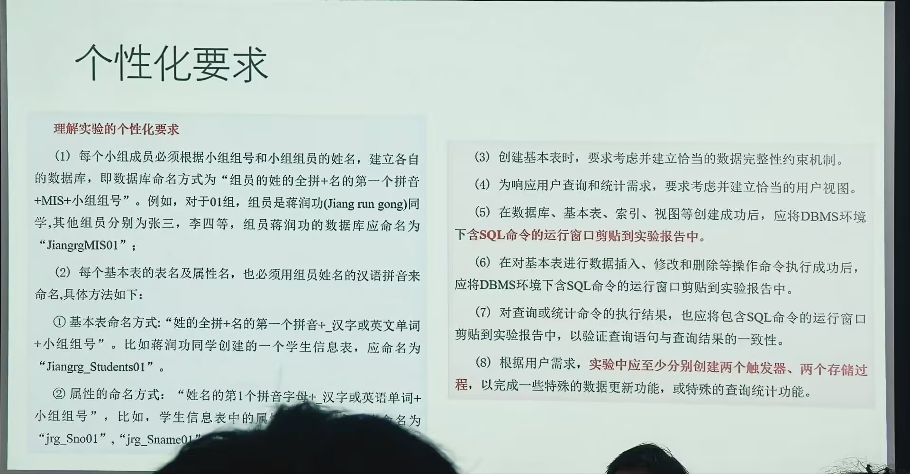
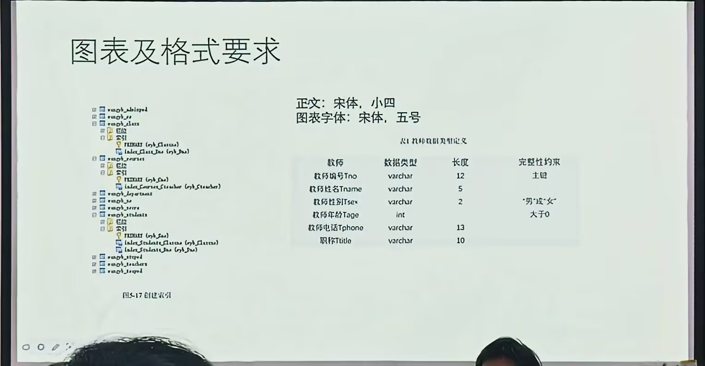
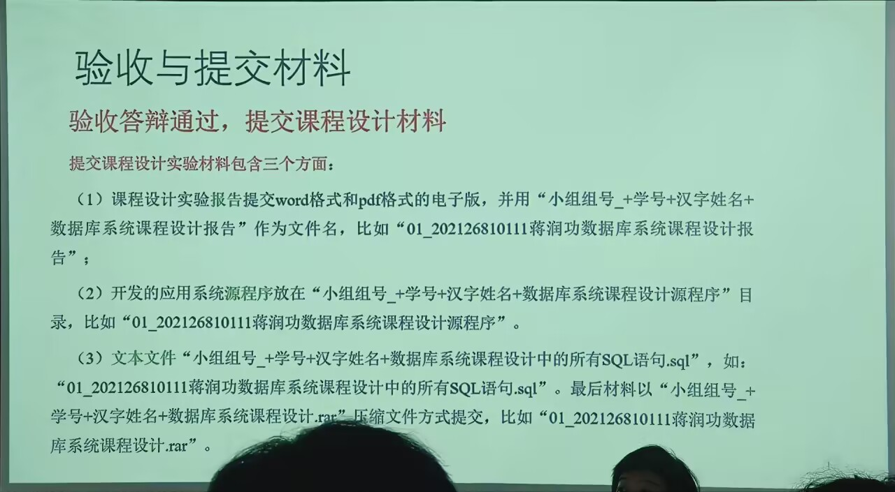
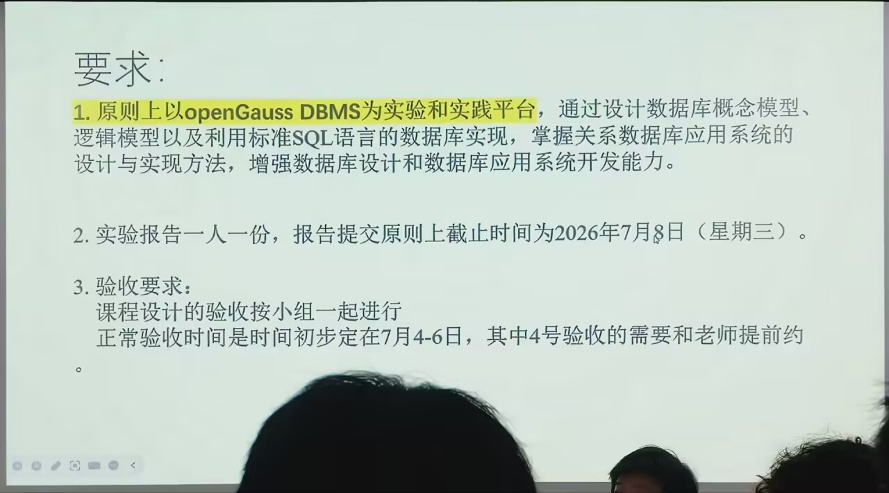
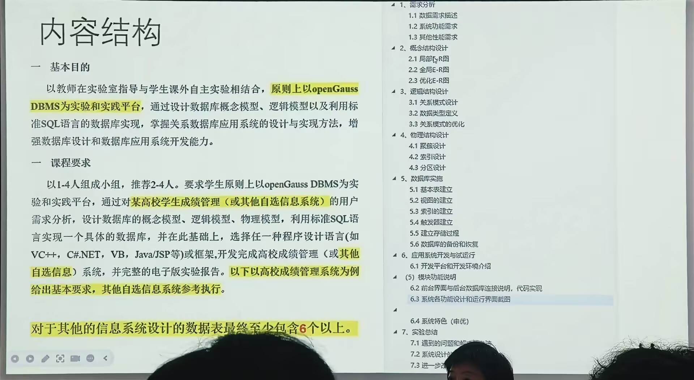

3~8自己完成 只有数据库设计部分是小组的功劳
命令要有专门的文档
命令窗口运行截图都要放到实验报告里
要达到什么效果要有验证

最早是到四号验收, 共4~7号
成绩包括

1. 验收展示效果
2. 验收答辩成绩
3. 提交的报告
   报告不是文字越多越好，推荐60~70页; 报告一组一份, 7号就要提交掉
   提交 1.报告, 2. 源程序, 3.txt(里面放sql)
   验收时 小组组长讲概念设计，逻辑设计,物理设计; 后面每个人讲自己的实现部分

最早是到四号验收, 共4~7号
成绩包括

1. 验收展示效果
2. 验收答辩成绩
3. 提交的报告
   报告不是文字越多越好，推荐60~70页; 报告一组一份, 7号就要提交掉
   提交 1.报告, 2. 源程序, 3.txt(里面放sql)
   验收时 小组组长讲概念设计，逻辑设计,物理设计; 后面每个人讲自己的实现部分

最早是到四号验收, 共4~7号
成绩包括

1. 验收展示效果
2. 验收答辩成绩
3. 提交的报告
   报告不是文字越多越好，推荐60~70页; 报告一组一份, 7号就要提交掉
   提交 1.报告, 2. 源程序, 3.txt(里面放sql)
   验收时 小组组长讲概念设计，逻辑设计,物理设计; 后面每个人讲自己的实现部分

最早是到四号验收, 共4~7号
成绩包括

1. 验收展示效果
2. 验收答辩成绩
3. 提交的报告
   报告不是文字越多越好，推荐60~70页; 报告一组一份, 7号就要提交掉
   提交 1.报告, 2. 源程序, 3.txt(里面放sql)
   验收时 小组组长讲概念设计，逻辑设计,物理设计; 后面每个人讲自己的实现部分

可以进行数据库底层的探究, 可以和新技术结合
